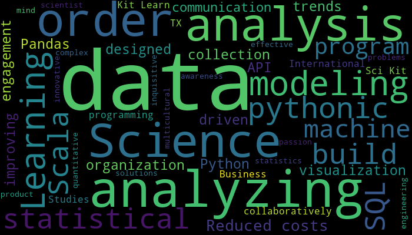
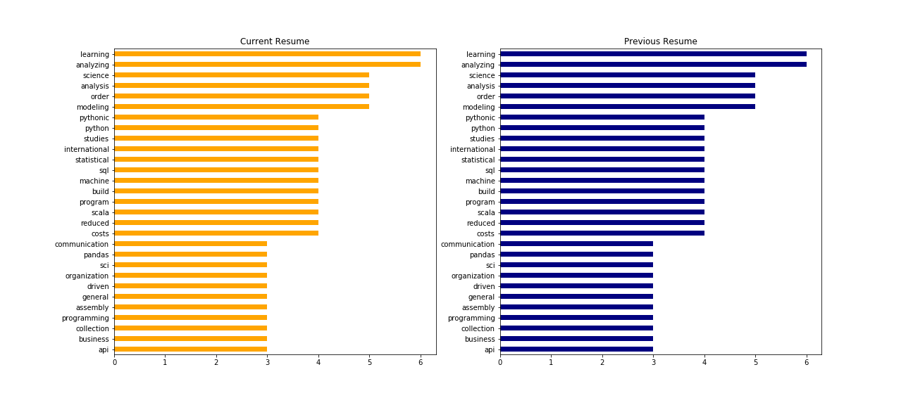
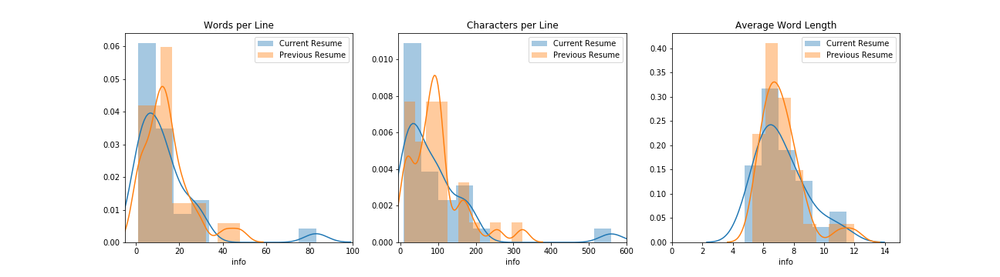
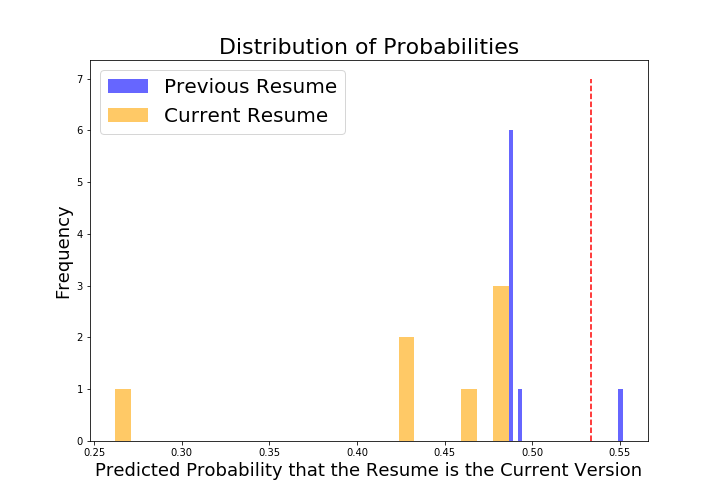

# My Resume Word Cloud
___

In order to display my skills and experience in a more interesting visualization, I created a word cloud out of the content in my resumes.

I will then conduct further data analysis in order to better understand what others may see by glancing at my resume. As a result, I may be able to better assess how I can improve the content of my resume to showcase myself and my abilities.

## Exploratory Data Analysis

I pulled the text content from two of the resumes that I recently drafted in order to draft a word cloud and conduct a comparison.

I then compared the frequently used words and sentence structure of the resumes.

## Model the Data

Although I did not see noticeable differences between the resumes, I built a gridsearch over a logistic regression model to predict which resume a line of text came from.

## Conclusions

I was not able to find a significant amount of differences in the sentence structure or word frequency of the resumes, which I believe was because I drafted both of the resumes very recently. The accuracy of the testing sample was consistently below the baseline accuracy, which seemed to confirm my intuition.

It would have been interesting to see if my sentence structure changed over a longer period of time, instead of just one week apart. It would also be interesting to see how the frequently-used words vary as I get more experience or cater my resume to different careers or industries.
